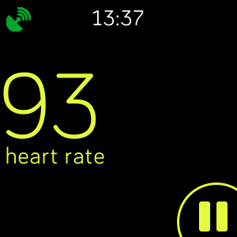
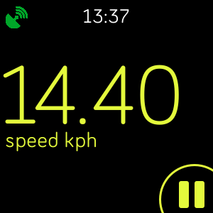
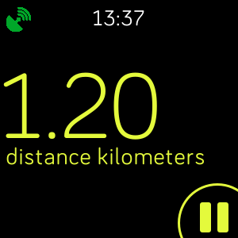
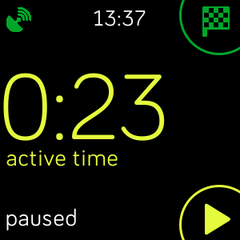

# sdk-exercise

SDK example application which demonstrates the usage of the
[Exercise API](https://dev.fitbit.com/build/reference/device-api/exercise/)
added in Fitbit OS 3.0.

This app is also intended to be used as an example for building multi-screen
applications, and is built using the excellent
[Ionic Views framework](https://github.com/gaperton/ionic-views) by
[gaperton](https://twitter.com/gaperton).

There are 3 main screens (/app/views) in the application:

* Select - The initial view which lets the user begin the exercise by pressing a
  button. It also initiates the Geolocation API as this can take a few moments
  to establish a location fix.

* Exercise - This view automatically starts the exercise once the GPS location
  is established. Every second the activity stats are updated on screen, and
  the user can cycle through different stats by tapping the screen. The user may
  `pause` and `resume` the exercise, or `pause` then `finish`.

* End - This final screen is displayed once the exercise has finished, and
  displays summary information about the completed session.

### Screenshot

    
